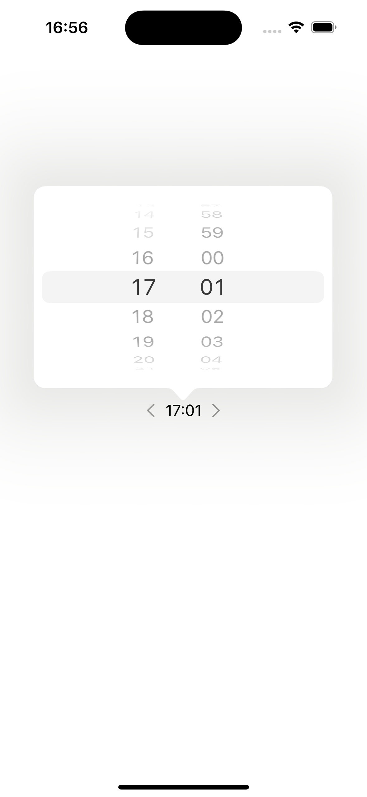
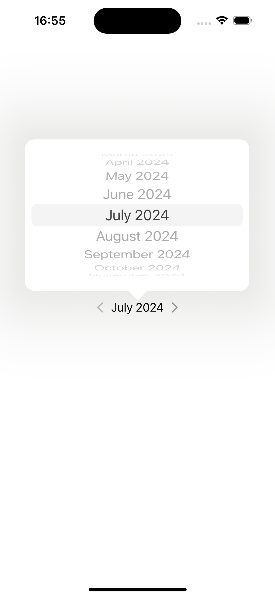

# ExtendedDatePicker

`DatePicker` from SwiftUI only has two modes (`date`, and `hourAndMinute`) which for many cases is not sufficient. Often you need to switch between even more modes. ExtendedDatePicker supports a bigget set of modes, so that you can spend your time on what matters the most - building useful experiencees for your users. 

| Hour | Date |  DateTime | Week |  MonthYear| Year| 
| - | - | - | - | - | - |
|  |   |  |  |  | 

## Installation
`ExtendedDatePicker` is available to be installed in your app via [Swift Package Manager](https://www.swift.org/documentation/package-manager/) using the git url `https://github.com/abdullah-original/ExtendedDatePicker.git`.

Both a static and a dynamic library are provided. 

## Usage

```swift
ExtendedDatePicker(
  selectedDate: Binding<Date>,
  dateRange: ClosedRange<Date>,
  mode: DateMode,
  calendar: Calendar,
  options: ExtendedDatePickerOptions
)
```

Initialize the date picker as above. If you want to provide a custom locale or timezone, do so via the calendar parameter, otherwise the the default will be used. 

In addition, some UI elements (such as back and forward arrows) can be customized using `options: ExtendedDatePickerOptions` parameter.


The client must provide at least `selectedDate`, `dateRange`, `mode`  parameters. `selectedDate` is the state object that keeps track of currently selected date by user. 

Info about date modes:
- `week`:  If the user has selected 2-8 February 2024, for example, `selectedDate` would be `2-2-2024`. 
- `monthYear`: If the user has selected February 2024, for example, `selectedDate` would be `x-2-2024`. No guarantees are made about `x`. 
- `year`:  If the user has selected 2024, for example, `selectedDate` would be `x-y-2024`. No guarantees are made about `x` or `y`.

In `monthYear` or `year` mode, client should just extract the relevent component from `selectedDate` i.e. `calendar.component(.year, from: selectedDate)`.

## Feedback
If you have any feedback or improvements to suggest, please free to open an issue. 
